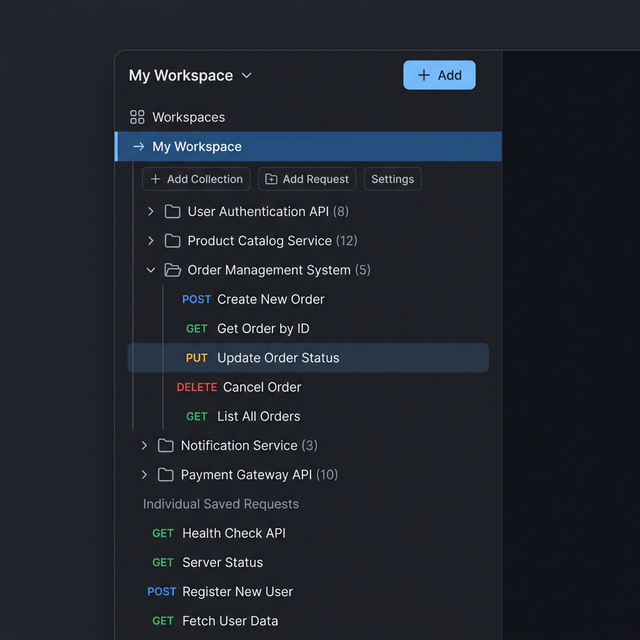
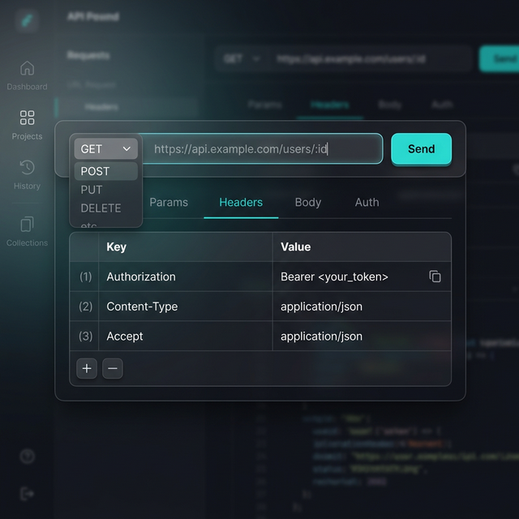
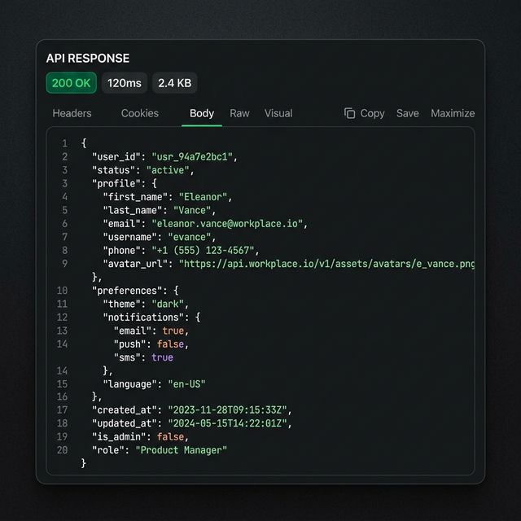

# ApiTest User Guide

Welcome to **ApiTest**, your modern, streamlined platform for building, sending, and managing API requests. This guide will walk you through the core features of the platform from an end-user perspective, helping you organize your workflows and test APIs efficiently.

---

## 1. Organizing Your Work (Workspaces & Collections)

The foundation of ApiTest is organization. You can structure your API requests logically just like a file system.

### Workspaces
A **Workspace** is the highest level of organization. It usually represents a specific project, heavily used by a specific team (e.g., "E-Commerce App" or "Payment Gateway").

### Collections
Inside a Workspace, you can create **Collections**. Think of these as folders to group related endpoints together (e.g., "Users API", "Orders API").

### Workspace-Level vs Collection-Level Requests
Our platform is highly flexible:
- **Collection Requests**: You can save a request inside a specifically created Collection for deep organization.
- **Direct Workspace Requests**: You can save a request *directly* under a Workspace. These will appear at the top of your Sidebar tree, perfect for quick scripts, one-off tests, or general queries.

*(Example: A well-organized Workspace showing both independent requests and categorized Collections)*

---

## 2. Creating & Sending Requests (The Request Builder)

The Request Builder is where all the magic happens. It is divided into three main sections: The URL Bar, Configuration Tabs, and the Response View.

*(Example: Building a GET Request with specific custom Headers)*

### HTTP Method & URL
At the very top, select your desired HTTP method (GET, POST, PUT, DELETE, PATCH) from the dropdown, and enter the target API endpoint URL.

### Query Parameters (Params)
Instead of manually typing long query strings (`?sort=desc&limit=10`), use the **Params** tab. Enter your `Key` and `Value` pairs in the interactive table, and the platform will automatically append them correctly to your URL.

### Path Parameters
Our platform features **Smart Path Detection**. If your API requires a path variable—for example, `/users/:id`—the platform automatically detects the `:id` parameter and creates a dedicated input box for you to fill it in dynamically.

### Headers
Use the **Headers** tab to pass any required metadata or authentication exactly as you need to.
- Example keys: `Authorization`, `Content-Type`, `Accept`
- Example values: `Bearer <token>`, `application/json`

### Body
For `POST`, `PUT`, and `PATCH` requests, switch to the **Body** tab. Here you can write raw text or structural JSON payloads to send data to your server.

---

## 3. Analyzing Responses

Once you click the bright **Send** button, the Response Panel will populate almost instantly.

*(Example: Successful 200 OK Response featuring beautiful syntax highlighting)*

The Response panel gives you immediate insights:
- **Status Badge**: Quickly see if the request succeeded (`200 OK`) or failed (`404 Not Found`, `500 Server Error`).
- **Time Taken**: See the exact latency in milliseconds (`ms`), crucial for performance testing.
- **Payload Size**: Track the bandwidth of the response (e.g., `2.4 KB`).
- **Response Body**: An integrated code editor provides beautiful syntax highlighting, indenting complex JSON responses so they are incredibly easy to read and debug.

---

## 4. History Tracking

Ever lost an API request you spent 10 minutes perfectly configuring? Not here.

Every time you hit Send, ApiTest automatically logs the exact URL, Headers, method, and Body you used. Navigate to the **History** tab (clock icon) to see a chronological feed of your past API calls.

Clicking on any historical request will **instantly reload** it into the Request Builder, allowing you to replay or modify past requests effortlessly!

---

## 5. Account Management & Security

To ensure your Workspaces, Collections, and Saved Requests persist securely, create a free account.
All accounts are protected by enterprise-grade **SHA-256 pre-hashed bcrypt** passwords, ensuring your data is safe even if the platform scales rapidly. 

Enjoy exploring your APIs! Let us know if you have any questions or feature requests.
